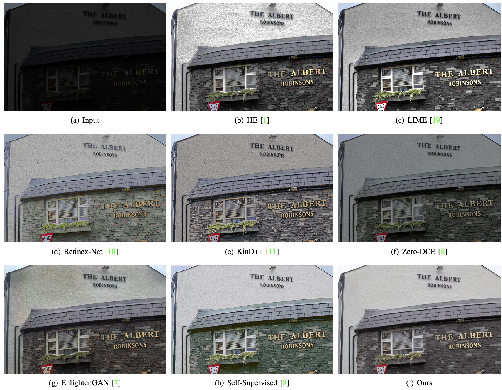

## HEP

[Unsupervised Low-Light Image Enhancement via Histogram Equalization Prior](https://arxiv.org/abs/2112.01766)

## Implementation
* Python3
* PyTorch>=1.0
* NVIDIA GPU+CUDA

## Установка зависимостей

Для установки всех необходимых библиотек выполните следующую команду, если нет видеокарты:

```bash
pip install albumentations==1.4.13 matplotlib==3.9.1.post1 numpy==1.26.4 open3d==0.18.0 opencv-python==4.10.0.84 pandas==2.2.2 pillow==10.4.0 pytorch-lightning==2.4.0 scikit-image==0.24.0 scikit-learn==1.5.1 scipy==1.11.0 torch==2.3.0+cpu torchvision==0.18.0+cpu torchmetrics==1.4.1 albucore==0.0.16 -f https://download.pytorch.org/whl/torch_stable.html matplotlib jupyterlab
```
Для установки всех необходимых библиотек выполните следующую команду, если есть видеокарта:
```bash
pip install albumentations==1.4.13 matplotlib==3.9.1.post1 numpy==1.26.4 open3d==0.18.0 opencv-python==4.10.0.84 pandas==2.2.2 pillow==10.4.0 pytorch-lightning==2.4.0 scikit-image==0.24.0 scikit-learn==1.5.1 scipy==1.11.0 torch==2.3.0+cu121 torchvision==0.18.0+cu121 torchmetrics==1.4.1 albucore==0.0.16 -f https://download.pytorch.org/whl/torch_stable.html matplotlib jupyterlab
```

## Training process

The original LOL dataset can be downloaded from [here](https://daooshee.github.io/BMVC2018website/).
The EnlightenGAN dataset can be downloaded from [here](https://drive.google.com/drive/folders/1fwqz8-RnTfxgIIkebFG2Ej3jQFsYECh0)
Before starting training process, you should modify the data_root in `./config`, and then run the following command

```shell
python LUM_train.py
python NDM_train.py
```

### Testing process

Please put test images into 'test_images' folder and download the pre-trained checkpoints from [google drive](https://drive.google.com/drive/folders/1LaeLhaFkrB7a7u5t-mVPuK81C4K1gtil?usp=sharing)(put it into `./checkpoints`), then just run

```shell
python NDM_test.py
```

You can also just evaluate the stage one (LUM), just run

```shell
python LUM_test.py
```

## Paper Summary
HEP consists of two stages, Light Up Module (LUM) and Noise Disentanglement Module (LUM)


## Representative Visual Results




More visual results can be found in asssets.

## Citation
if you find this repo is helpful, please cite
```
@article{zhang2021unsupervised,
  title={Unsupervised Low-Light Image Enhancement via Histogram Equalization Prior},
  author={Zhang, Feng and Shao, Yuanjie and Sun, Yishi and Zhu, Kai and Gao, Changxin and Sang, Nong},
  journal={arXiv preprint arXiv:2112.01766},
  year={2021}
}
```
